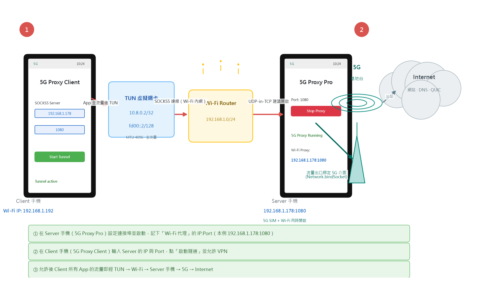
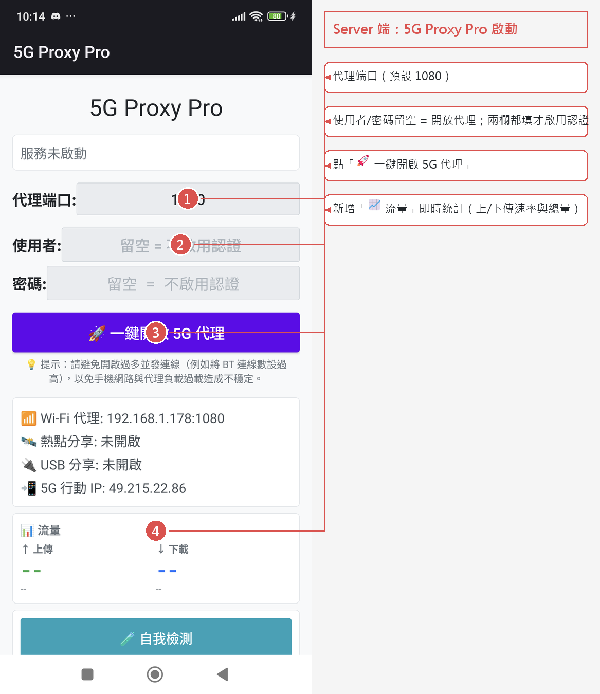
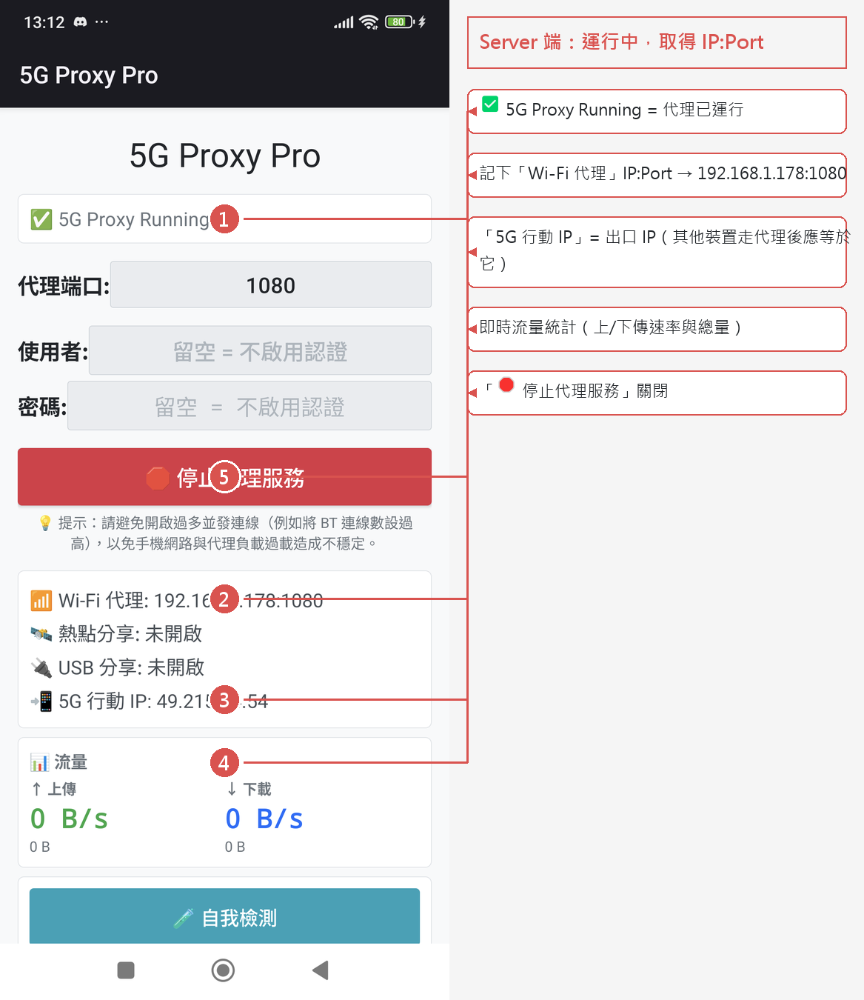
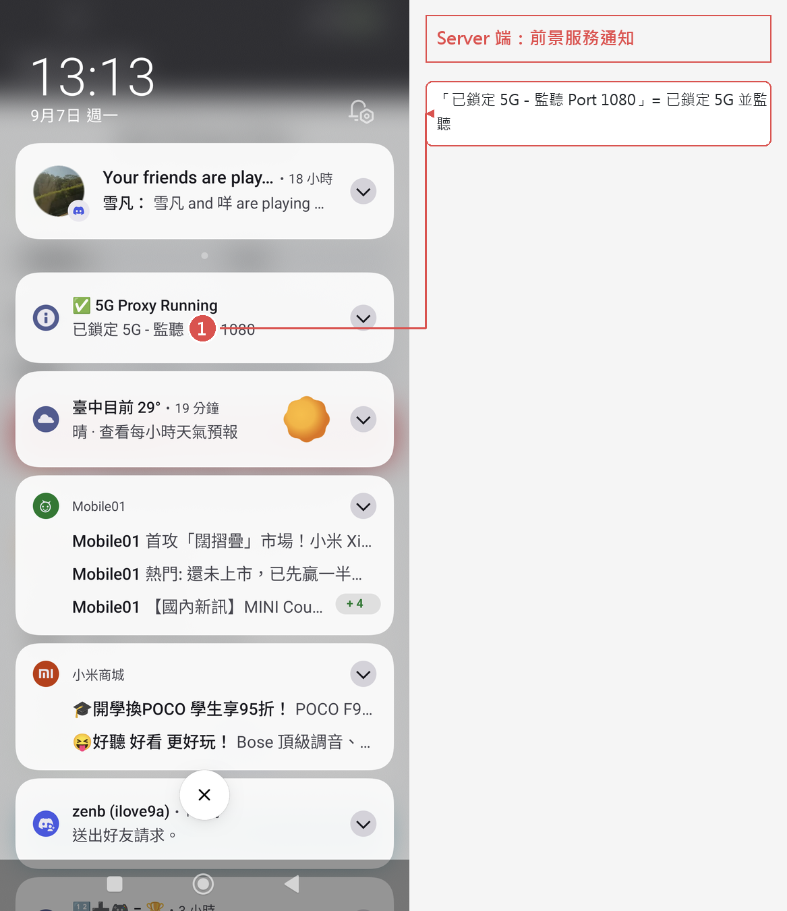
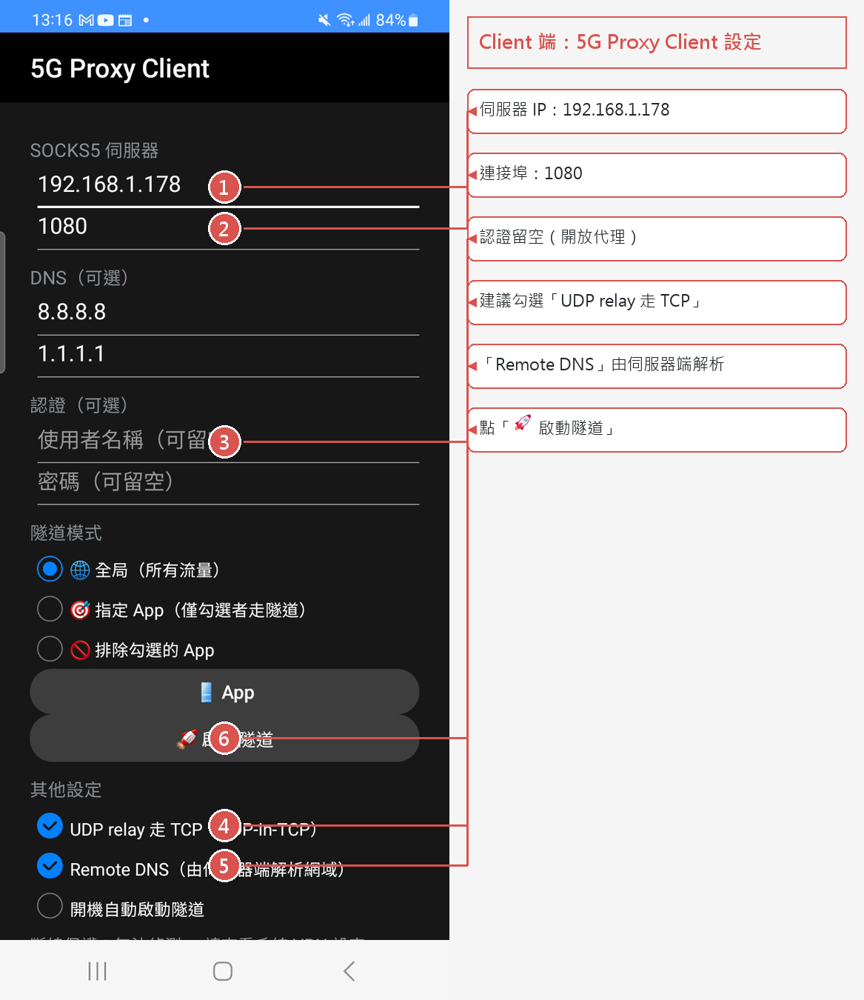
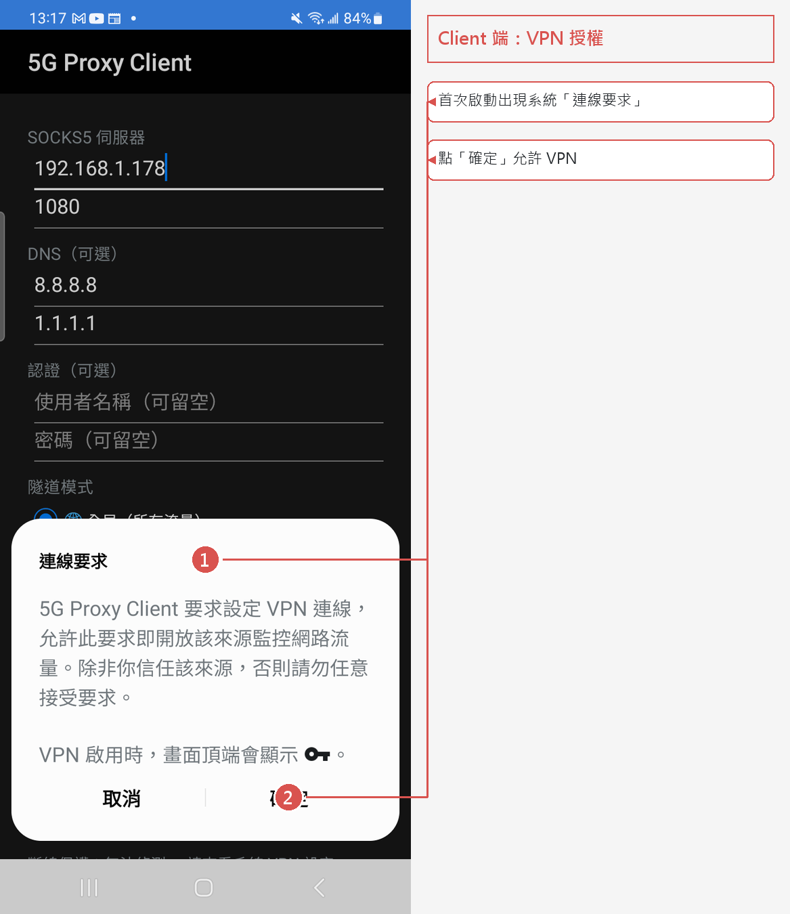
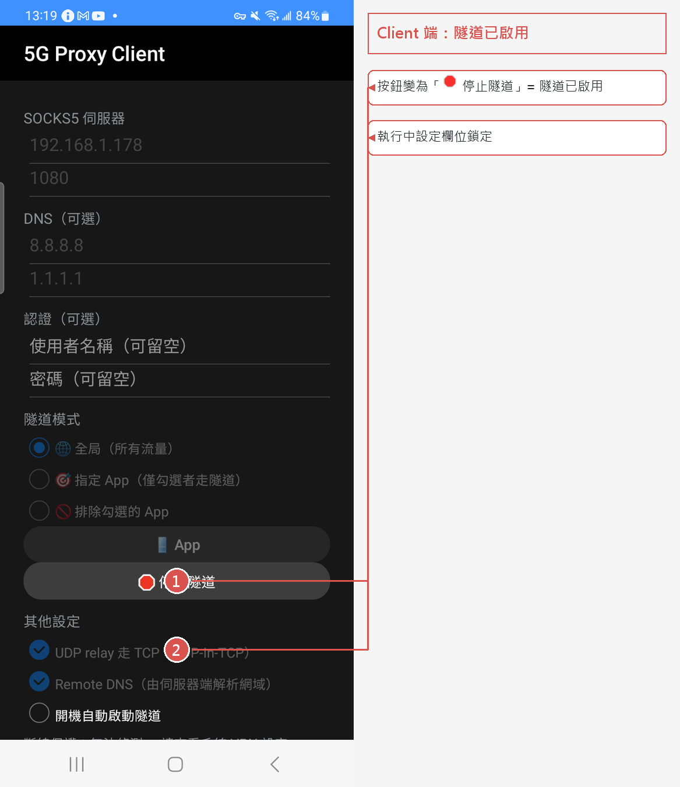
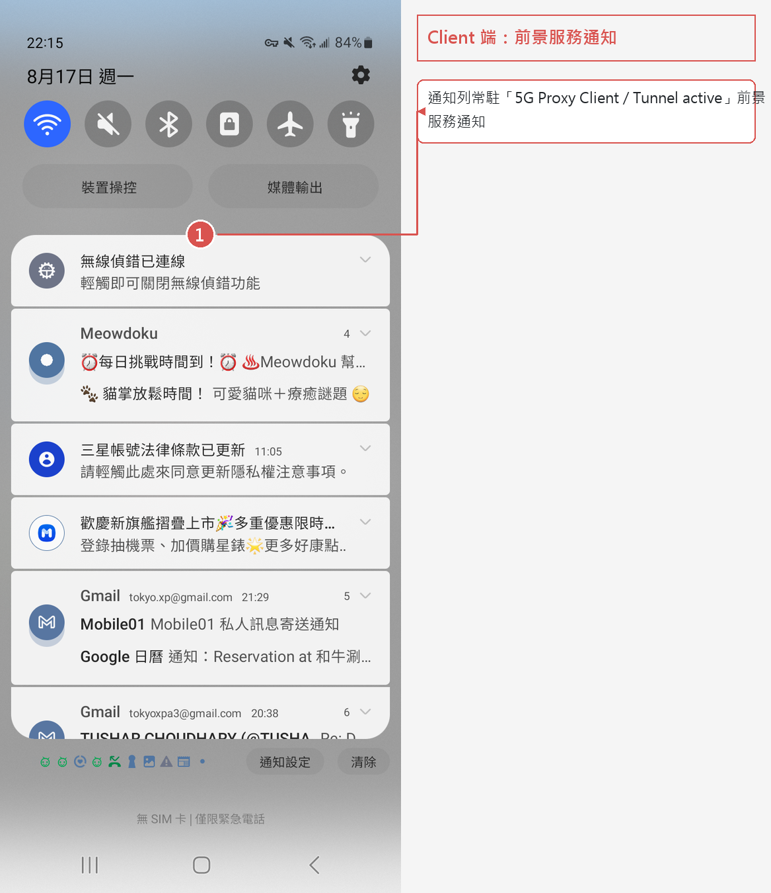

# 5G Proxy Client 完整圖文操作教學

> 把 **Client 手機的所有網路流量**，透過 **Server 手機的 5G 網路** 對外上網的完整設定流程。
> 本教學使用實機截圖（已用 Python 加註細節），環境與截圖完全一致，照著做即可。

---

## 1. 名詞與架構

| 角色 | App | 裝置 | 說明 |
|---|---|---|---|
| **Server 端** | 5G Proxy Pro（`com.tokyoxpa3.androidproxy`） | 小米手機 192.168.1.178 | 鎖定 5G 網路，在 Wi-Fi 內網開 SOCKS5 代理 |
| **Client 端** | 5G Proxy Client（`com.tokyoxpa3.socksclient`） | 三星手機 192.168.1.192 | 建立 TUN 隧道，把全部流量導向 Server 的代理 |

### 整體架構



流量路徑：

```
[Client 所有 App] --TUN 10.8.0.2--> [C 引擎: tun_socks.c] --SOCKS5 (Wi-Fi 內網)--> [Server 手機 192.168.1.178:1080] --5G 介面--> [Internet]
```

- **TCP**：透過 SOCKS5 CONNECT 轉發（使用者空間 TCP 狀態機，含流量控制）
- **UDP / DNS / QUIC**：透過 SOCKS5 UDP ASSOCIATE relay；與 5G Proxy Pro 搭配時建議勾選「UDP relay 走 TCP（UDP-in-TCP）」（自訂擴充指令 0x04），UDP 資料走同一條 TCP，不受 UDP 壅塞影響
- **Per-App 排除**：「Excluded Apps」勾選的 App 走手機本機網路（繞過隧道）

---

## 2. 步驟 0：前置準備

1. 兩支手機**連同一個 Wi-Fi**（Server 端同一網段才能被連到）
2. **Server 手機必須插 SIM 卡且有 5G/4G 訊號**（5G Proxy Pro 靠鎖定蜂巢式網路運作）
3. 兩支手機都安裝好 APK（編譯方式見附錄）
4. 本教學使用**開放代理**（Server 端帳密兩欄都留空）

---

## 3. 步驟 1：Server 端啟動（5G Proxy Pro）

### 3.1 開啟 App，確認連接埠



1. **代理端口**：設為要對外提供的埠（預設 `1080`；本教學沿用 `1080`）
2. **使用者 / 密碼**：兩欄都留空 = 開放代理；**兩欄都填**才會啟用認證（RFC 1929）
3. 點 **「🚀 一鍵開啟 5G 代理」**

> 首次啟動（Android 13+）會要求**通知權限**，請允許，前景服務通知才能正常顯示。
> 另外依品牌提示（小米/三星/OPPO/Vivo）加入**電池最佳化白名單**，避免系統在背景殺掉 App 導致 5G 掉線。

### 3.2 啟動成功後，取得 Server 的 IP 與 Port



啟動後畫面會顯示（3 秒後自動刷新）：

- **✅ 5G Proxy Running** → 代理已運行
- **📶 Wi-Fi 代理: `192.168.1.178:1080`** ← **記下這個 IP:Port**（Client 端要輸入的值）
- **📲 5G 行動 IP: `49.215.85.39`** ← 驗證用：所有經代理出去的流量，出口 IP 都應等於它

> 監聽器只綁定 Wi-Fi / 熱點 / USB 分享等 LAN 介面，**不會暴露在行動網路介面上**。

### 3.3 Server 端前景服務通知



通知列會常駐 **「5G SOCKS5 Proxying / Locked 5G - Listening Port 1080」**，確認代理確實在監聽。

---

## 4. 步驟 2：Client 端設定並啟動（5G Proxy Client）

### 4.1 填入 Server 的 IP 與 Port



| 欄位 | 填入 | 說明 |
|---|---|---|
| **伺服器 IP** | `192.168.1.178` | Server 端「Wi-Fi 代理」顯示的 IP |
| **連接埠** | `1080` | Server 端「Wi-Fi 代理」顯示的 Port |
| 使用者名稱 / 密碼 | （留空） | 只有 Server 端有設帳密才需要填 |
| **UDP relay 走 TCP** | 勾選 | 建議勾選（與 5G Proxy Pro 搭配，DNS/QUIC 更穩） |

> 伺服器位址會在建立 VPN **之前**解析，避免自己的 DNS 查詢被隧道捕捉。

### 4.2 點「🚀 啟動隧道」→ 允許 VPN



第一次啟動會出現系統 **「連線要求」** 對話框：

> **5G Proxy Client 要求設定 VPN 連線，允許此要求即開放該來源監控網路流量。除非你信任該來源，否則請勿任意接受要求。**

點 **「確定」** 允許。拒絕的話隧道無法建立（之後可到系統設定 → VPN 重新允許）。

### 4.3 啟動成功



- 畫面顯示 **「✅ 隧道已啟用 (192.168.1.178:1080)」** → 成功
- 狀態列出現 **鑰匙圖示**（VPN 作用中）
- 通知列常駐 **「5G Proxy Client / Tunnel active」**：



> 停止方式：回到 App 點「🛑 停止隧道」，或從系統設定撤銷 VPN。

---

## 5. 步驟 3：驗證流量真的走 5G

驗證原理：Server 端「5G 行動 IP」= 49.215.85.39，任何**經代理出去的流量**，出口 IP 都應等於它。

### 方法 A：PC 上透過代理存取（本教學實測）

```powershell
curl.exe -s --proxy socks5h://192.168.1.178:1080 https://api.ipify.org
```

本教學實際執行結果：

```text
49.215.85.39        <- 與 Server 端「5G 行動 IP」完全一致（成功）
```

### 方法 B：Client 手機本機驗證（隧道內流量）

在 Client 手機（透過 adb）執行：

```bash
adb -s 192.168.1.192:39013 shell "curl -s https://api.ipify.org"
```

本教學實際執行結果：

```text
49.215.85.39        <- Client 手機的出口 IP = Server 的 5G IP，證明流量全部走隧道（成功）
```

### 方法 C：其他驗證

| 驗證 | 做法 | 預期結果 |
|---|---|---|
| **測速** | `curl.exe -o NUL --proxy socks5h://192.168.1.178:1080 https://speed.cloudflare.com/__down?bytes=100000000` | 有吞吐量即代表 CONNECT 轉發正常 |
| **DNS 穿透** | 代理為 `socks5h`（H 代表 DNS 由代理解析） | 任何網域都可解析 |
| **UDP/QUIC** | Client 手機用 Chrome（支援 QUIC）開 YouTube | 能播放 = UDP relay（UDP-in-TCP）正常 |
| **排除 App** | Client 端「🚫 Excluded Apps」勾選某 App | 該 App 出口 IP 為 Wi-Fi 線路（如 PC 直連的 59.126.201.28），其餘仍走 5G |

---

## 6. 常見問題

| 症狀 | 原因 | 解決方法 |
|---|---|---|
| Client 一直「正在解析伺服器位址…」 | 伺服器 IP/Port 填錯 | 回 Server 端重新確認「Wi-Fi 代理」顯示的值 |
| 連到 Server 但 SOCKS5 握手無回應 | 填到了 **ADB 埠**（35577/39013）而非代理埠 | 代理埠以 App「Wi-Fi 代理」顯示為準（預設 1080） |
| Server 顯示「❌ Proxy Failed to Start」 | 手機沒有 LAN 介面或 5G 訊號 | 確認 Wi-Fi 已連線、SIM 卡有訊號 |
| Server 的 5G 常掉線 | 電池最佳化把 App 掛在背景 | 依品牌設定加入電池白名單（小米關閉「5G 電池省電模式」等） |
| Client 按啟動沒反應 / Toast 顯示輸入錯誤 | 伺服器位址或埠格式不對 | 確認 IP 格式、Port 在 1~65535 之間 |
| VPN 對話框按了拒絕 | 使用者拒絕授權 | 到 系統設定 → VPN（或 App 資訊 → 更多設定）重新允許 |
| 有 VPN 鑰匙但無法上網 | Server 沒啟動、或 Server 換了 Wi-Fi IP | 檢查 Server 端狀態與「Wi-Fi 代理」IP 是否仍相同 |

---

## 7. 附錄

### 7.1 用 ADB 遠端操作兩支手機（本教學使用）

```powershell
# Server 手機（小米）
adb connect 192.168.1.178:35577
adb -s 192.168.1.178:35577 shell am start -n com.tokyoxpa3.androidproxy/.DebugActivity

# Client 手機（三星）
adb connect 192.168.1.192:39013
adb -s 192.168.1.192:39013 shell am start -n com.tokyoxpa3.socksclient/.MainActivity

# 截圖
adb -s <serial> shell screencap -p /sdcard/s.png
adb -s <serial> pull /sdcard/s.png
```

### 7.2 自行編譯 APK

- **5G Proxy Pro**：`cd 5G-Proxy-Pro; .\gradlew.bat assembleDebug` → `app/build/outputs/apk/debug/app-debug.apk`（需求 JDK 17、SDK Platform 34、NDK 26.3.11579264、CMake 3.22.1）
- **5G Proxy Client**：`cd 5G-Proxy-Client; .\gradlew.bat assembleDebug` → `app/build/outputs/apk/debug/app-debug.apk`（需求 SDK + NDK 26.3.11579264，支援 arm64-v8a / armeabi-v7a）

### 7.3 安全注意事項

- 未設帳密時為**開放代理**：任何連得到 Server Wi-Fi IP 的裝置都能用，請只在信任的區域網路使用，或設定帳密保護
- Server 端代理只綁定 LAN 介面，不會暴露在行動網路介面上
- 本專案僅供個人/旁載使用（Client 端需要 `QUERY_ALL_PACKAGES` 權限才能列出完整 App 清單）

---

## 8. 本教學的圖檔來源

| 檔案 | 說明 |
|---|---|
| `docs/shots/*.png` | 實機截圖（未加註版） |
| `docs/shots/*_annotated.png` | 實機截圖 + Python（PIL）加註版，用於本文件 |
| `docs/figures/fig1_architecture.png` | Python（matplotlib）繪製的架構圖 |
| `docs/annotate_shots.py` | 截圖加註工具（執行：`python docs/annotate_shots.py`） |
| `docs/gen_figures.py` | 架構圖產生器（執行：`python docs/gen_figures.py`） |
